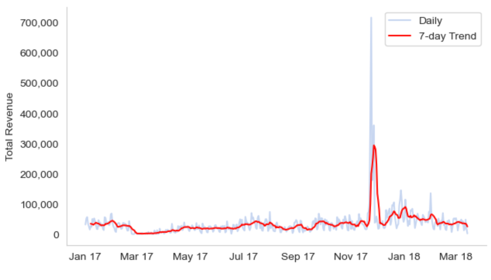
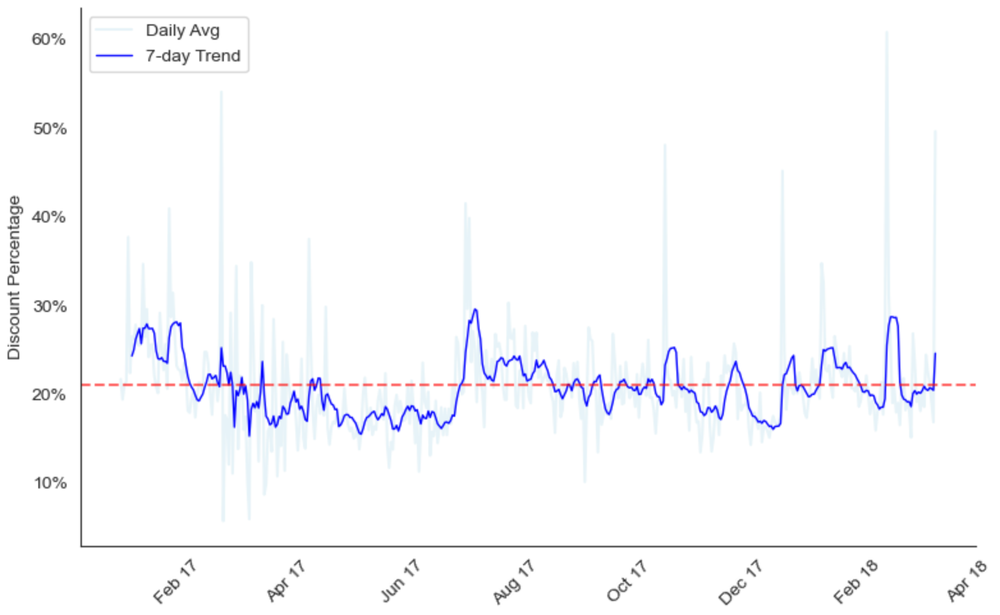

# Eniac's Discount Strategy: Revenue & Margin Optimization

## 📌 Project Overview
The objective of this project was to evaluate the impact of Eniac's permanent discount model on its financial performance (2017-2018). By analyzing **46,000+ orders**, I identified the optimal discount threshold to maximize revenue while halting unnecessary margin erosion.

---

## 📊 Key Business Insights

### 1. The "Default Discount" Trap
Analysis reveals that discounting has shifted from a tactical lever to a permanent state. **93.1% of all order lines** were sold with a markdown, indicating a high dependency on price-cutting that may dilute brand equity in the long run.

### 2. Identifying the "Sweet Spot"
Through scenario modeling, I identified a clear **Optimal Revenue Zone**. Revenue peaks at a moderate discount depth of **20-25%**. Beyond 30%, additional discounts fail to generate incremental volume and lead to a sharp decline in net margins.

  

### 3. Seasonality vs. Price Elasticity
Sales spikes are primarily synchronized with **major calendar events** (e.g., Black Friday, Q4 holidays) rather than the depth of the discount itself. Outside of peak periods, the correlation between discount size and daily revenue remains statistically weak.

<table border="0">
  <tr>
    <td width="47%" valign="middle">
      
      
<em>Figure 1: Revenue Seasonality Trends</em>

    </td>
    <td width="2%"></td> 
    <td width="44%" valign="middle">
      
      
<em>Figure 2: Discount Depth Volatility</em>

    </td>
  </tr>
</table>

---

## 🛠️ Tech Stack & Methodology
* **Language:** Python (Pandas, NumPy)
* **Visualization:** Matplotlib, Seaborn
* **Analytics:** ETL (Data Cleaning), Correlation Analysis, Time-Series Analysis, Scenario Modeling
* **Domain:** E-commerce / Revenue Management

## 📂 Project Structure
* `discount_analysis.ipynb` — Full end-to-end Python pipeline (Data cleaning, processing, and visualization).
* `Eniac_Discount_Strategy.pdf` — Executive summary with visual storytelling and strategic data-driven recommendations.

## 💡 Strategic Recommendations
1. Reallocate the marketing budget to high-seasonality periods where price elasticity is naturally higher.
2. Cap general discounts at the **20-25% range** to maintain a healthy balance between volume and profit.
3. Protect "Premium Anchors" (e.g., Apple hardware) from deep discounts, using accessories as the primary "Traffic Magnets."
